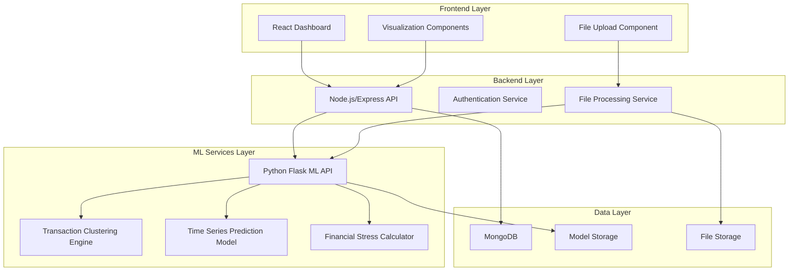

# Design Document: Financial Health Prediction System

## Overview

FinSense is an AI-powered wealth intelligence system that transforms traditional expense tracking into predictive financial health analysis. The system leverages machine learning to automatically categorize transactions, predict future financial outcomes, and provide actionable insights through an intuitive dashboard.

The architecture follows a microservices approach with clear separation between the MERN stack web application and Python-based machine learning services. This design enables scalable, maintainable, and intelligent financial analysis while ensuring data security and real-time performance.

## Architecture

### High-Level Architecture



### Service Communication

The system uses RESTful APIs for communication between services:
- **Frontend ↔ Node.js**: Standard HTTP/HTTPS with JWT authentication
- **Node.js ↔ Python ML**: HTTP API calls with JSON payloads
- **Services ↔ Database**: Direct database connections with connection pooling

## Components and Interfaces

### Frontend Components (React)

**Dashboard Component**
- Displays financial overview, trends, and predictions
- Integrates with Recharts for interactive visualizations
- Implements responsive design with Tailwind CSS
- Real-time updates via WebSocket connections

**File Upload Component**
- Handles CSV file selection and validation
- Provides upload progress feedback
- Implements drag-and-drop functionality
- Validates file format before processing

**Prediction Visualization Component**
- Renders time-series charts with historical and predicted data
- Shows confidence intervals and model accuracy metrics
- Displays financial stress alerts and recommendations
- Interactive filtering by date ranges and categories

### Backend Services (Node.js/Express)

**API Gateway Service**
```javascript
// Core API endpoints
POST /api/transactions/upload     // CSV file upload
GET  /api/transactions           // Retrieve transactions
POST /api/ml/categorize          // Trigger categorization
GET  /api/ml/predictions         // Get financial predictions
GET  /api/dashboard/summary      // Dashboard data
```

**Authentication Service**
- JWT-based authentication with refresh tokens
- User session management
- Role-based access control
- Password encryption using bcrypt

**File Processing Service**
- CSV parsing and validation
- Data transformation and cleaning
- Batch processing for large files
- Error handling and logging

### Machine Learning Services (Python/Flask)

**ML API Service**
```python
# Core ML endpoints
POST /ml/categorize              # Transaction categorization
POST /ml/predict                 # Financial predictions
POST /ml/stress-score           # Calculate financial stress
POST /ml/retrain                # Model retraining
```

**Transaction Clustering Engine**
- Uses scikit-learn's KMeans and DBSCAN algorithms
- Feature extraction from transaction descriptions
- TF-IDF vectorization for text analysis
- Automatic category assignment with confidence scores

**Time Series Prediction Model**
- Implements LSTM neural networks for sequence prediction
- Uses scikit-learn for preprocessing and feature scaling
- 30-day balance forecasting with confidence intervals
- Model performance tracking and validation

**Financial Stress Calculator**
- Analyzes spending patterns and income trends
- Calculates risk scores based on prediction models
- Generates personalized recommendations
- Threshold-based alert system

## Data Models

### User Model
```javascript
{
  _id: ObjectId,
  email: String,
  passwordHash: String,
  profile: {
    firstName: String,
    lastName: String,
    preferences: {
      currency: String,
      alertThreshold: Number
    }
  },
  createdAt: Date,
  updatedAt: Date
}
```

### Transaction Model
```javascript
{
  _id: ObjectId,
  userId: ObjectId,
  date: Date,
  amount: Number,
  description: String,
  category: {
    name: String,
    confidence: Number,
    isUserVerified: Boolean
  },
  rawData: {
    originalDescription: String,
    source: String
  },
  createdAt: Date
}
```

### Prediction Model
```javascript
{
  _id: ObjectId,
  userId: ObjectId,
  predictionDate: Date,
  targetDate: Date,
  predictedBalance: Number,
  confidenceInterval: {
    lower: Number,
    upper: Number
  },
  modelVersion: String,
  accuracy: Number,
  createdAt: Date
}
```

### Financial Stress Model
```javascript
{
  _id: ObjectId,
  userId: ObjectId,
  score: Number,
  factors: [{
    category: String,
    impact: Number,
    description: String
  }],
  recommendations: [String],
  calculatedAt: Date
}
```

### ML Model Metadata
```javascript
{
  _id: ObjectId,
  modelType: String, // 'clustering', 'prediction', 'stress'
  version: String,
  accuracy: Number,
  trainingDate: Date,
  parameters: Object,
  performance: {
    mae: Number,
    rmse: Number,
    r2Score: Number
  }
}
```
## Correctness Properties

*A property is a characteristic or behavior that should hold true across all valid executions of a system—essentially, a formal statement about what the system should do. Properties serve as the bridge between human-readable specifications and machine-verifiable correctness guarantees.*

### Property 1: CSV Validation Consistency
*For any* uploaded file, the validation result should be consistent with the file's actual format compliance—valid CSV files should always pass validation, and invalid files should always fail with descriptive error messages.
**Validates: Requirements 1.1, 1.4**

### Property 2: Data Extraction Completeness
*For any* valid CSV file with transaction data, the extraction process should preserve all transaction information (date, amount, description) without loss or corruption.
**Validates: Requirements 1.2**

### Property 3: Data Persistence Round-trip
*For any* extracted transaction data, storing it in the database and then retrieving it should yield identical information.
**Validates: Requirements 1.3**

### Property 4: Transaction Clustering Consistency
*For any* set of transactions with identical description patterns and similar amounts, the clustering engine should group them into the same category across multiple runs.
**Validates: Requirements 2.1**

### Property 5: Category Assignment Determinism
*For any* transaction with specific characteristics, the categorization system should assign the same category when presented with identical input data.
**Validates: Requirements 2.2**

### Property 6: Confidence-based Flagging
*For any* transaction with a confidence score below the threshold, the system should flag it for user review, and transactions above the threshold should not be flagged.
**Validates: Requirements 2.3**

### Property 7: Learning from Corrections
*For any* user correction applied to a transaction category, similar future transactions should be categorized according to the correction with higher confidence.
**Validates: Requirements 2.4**

### Property 8: Category Storage Completeness
*For any* categorized transaction, the stored result should include both the category assignment and its confidence score.
**Validates: Requirements 2.5**

### Property 9: Prediction Generation Threshold
*For any* user with transaction history spanning 3 or more months, the prediction model should generate 30-day balance forecasts.
**Validates: Requirements 3.1**

### Property 10: Time-series Pattern Recognition
*For any* historical transaction data with identifiable spending patterns, the prediction model should reflect those patterns in future forecasts.
**Validates: Requirements 3.2**

### Property 11: Stress Score Calculation
*For any* prediction indicating spending exceeding income, the system should calculate and display a financial stress score above the baseline threshold.
**Validates: Requirements 3.3**

### Property 12: Prediction Update Consistency
*For any* new transaction added to the system, the predictions should be updated to reflect the new data within the next daily update cycle.
**Validates: Requirements 3.4**

### Property 13: Prediction Metadata Completeness
*For any* generated prediction, the display should include confidence intervals and model accuracy metrics alongside the forecast values.
**Validates: Requirements 3.5**

### Property 14: Dashboard Data Completeness
*For any* user accessing the dashboard, the display should include current balance, spending trends, and category breakdowns based on their transaction data.
**Validates: Requirements 4.1**

### Property 15: Chart Data Accuracy
*For any* historical transaction data and predictions, the rendered charts should accurately represent all data points without omission or distortion.
**Validates: Requirements 4.2**

### Property 16: Alert Display Consistency
*For any* calculated financial stress score above the alert threshold, the dashboard should prominently display alerts and recommendations.
**Validates: Requirements 4.3**

### Property 17: Real-time Update Propagation
*For any* new transaction processed by the system, the dashboard visualizations should reflect the updated data in the next refresh cycle.
**Validates: Requirements 4.4**

### Property 18: Model Retraining Schedule
*For any* new transaction data added to the system, the ML engine should trigger model retraining according to the configured schedule.
**Validates: Requirements 5.1**

### Property 19: Performance-based Retraining
*For any* model whose performance metrics fall below acceptable thresholds, the system should automatically initiate retraining.
**Validates: Requirements 5.2**

### Property 20: Performance Metrics Logging
*For any* model execution, the system should log accuracy, prediction error, and other performance metrics to the monitoring system.
**Validates: Requirements 5.3**

### Property 21: Model Validation Gate
*For any* updated model, the system should validate its performance against test data before making it available for production use.
**Validates: Requirements 5.4**

### Property 22: Model Version Management
*For any* model update, the system should maintain version history and provide rollback capability to previous versions.
**Validates: Requirements 5.5**

### Property 23: Data Encryption Round-trip
*For any* financial data uploaded by users, encrypting and then decrypting the data should yield the original information without corruption.
**Validates: Requirements 6.1**

### Property 24: Access Control Enforcement
*For any* user attempting to access financial data, the system should grant access only if the user has proper authentication and authorization for that specific data.
**Validates: Requirements 6.2**

### Property 25: Data Export/Deletion Completeness
*For any* user requesting data export or deletion, the system should provide complete data export or ensure complete data removal as requested.
**Validates: Requirements 6.4**

### Property 26: PII Logging Prevention
*For any* data processing operation, the system logs should not contain personally identifiable information from the processed data.
**Validates: Requirements 6.5**

### Property 27: RESTful API Compliance
*For any* API endpoint in the system, the interface should follow REST principles including proper HTTP methods, status codes, and resource naming.
**Validates: Requirements 7.1**

### Property 28: Inter-service Contract Compliance
*For any* communication between Node.js and Python ML services, the data exchange should conform to the predefined API contract specifications.
**Validates: Requirements 7.2**

### Property 29: Error Handling Robustness
*For any* inter-service communication failure or timeout, the system should handle the error gracefully and provide appropriate user feedback.
**Validates: Requirements 7.3, 7.4**

### Property 30: API Interaction Logging
*For any* API call made within the system, the interaction should be logged with sufficient detail for monitoring and debugging purposes.
**Validates: Requirements 7.5**

## Error Handling

### Data Processing Errors
- **Invalid CSV Format**: Return structured error messages with specific format requirements
- **Corrupted Transaction Data**: Log errors and skip corrupted records while processing valid ones
- **Database Connection Failures**: Implement retry logic with exponential backoff
- **File Size Limits**: Reject files exceeding size limits with clear error messages

### Machine Learning Errors
- **Insufficient Training Data**: Gracefully handle cases with limited historical data
- **Model Training Failures**: Maintain previous model version and alert administrators
- **Prediction Errors**: Provide confidence intervals and uncertainty indicators
- **Service Unavailability**: Cache recent predictions and serve stale data with warnings

### API and Network Errors
- **Service Timeouts**: Implement circuit breaker pattern for ML service calls
- **Authentication Failures**: Return appropriate HTTP status codes with error details
- **Rate Limiting**: Implement request throttling with informative error responses
- **Data Validation Errors**: Return field-specific validation error messages

### User Interface Errors
- **Network Connectivity**: Provide offline indicators and retry mechanisms
- **Data Loading Failures**: Show error states with retry options
- **Chart Rendering Errors**: Fallback to tabular data display
- **Real-time Update Failures**: Indicate stale data and provide manual refresh options

## Testing Strategy

### Dual Testing Approach

The system will employ both unit testing and property-based testing to ensure comprehensive coverage:

**Unit Tests**: Verify specific examples, edge cases, and error conditions
- Test specific CSV formats and validation scenarios
- Test individual ML model components with known datasets
- Test API endpoints with specific request/response pairs
- Test UI components with mock data and user interactions

**Property-Based Tests**: Verify universal properties across all inputs
- Test data processing pipelines with randomly generated transaction data
- Test ML model behavior with various data distributions
- Test API contracts with generated request variations
- Test system behavior under different load conditions

### Property-Based Testing Configuration

The system will use **Hypothesis** for Python components and **fast-check** for JavaScript/TypeScript components. Each property test will:
- Run a minimum of 100 iterations to ensure statistical confidence
- Include shrinking to find minimal failing examples
- Be tagged with references to design document properties

**Test Tagging Format**: 
```
# Feature: financial-health-prediction, Property 1: CSV Validation Consistency
```

### Testing Framework Integration

**Backend Testing (Node.js)**:
- Jest for unit testing
- fast-check for property-based testing
- Supertest for API integration testing
- MongoDB Memory Server for database testing

**ML Service Testing (Python)**:
- pytest for unit testing
- Hypothesis for property-based testing
- scikit-learn test utilities for model validation
- Mock services for external dependencies

**Frontend Testing (React)**:
- Jest and React Testing Library for component testing
- fast-check for property-based UI testing
- Cypress for end-to-end testing
- Mock Service Worker for API mocking

### Test Data Management

**Synthetic Data Generation**:
- Generate realistic transaction data for testing
- Create various CSV formats for validation testing
- Simulate different user behavior patterns
- Generate edge cases and boundary conditions

**Test Environment Isolation**:
- Separate test databases for each test suite
- Isolated ML model training environments
- Containerized testing infrastructure
- Automated test data cleanup

### Continuous Testing

**Automated Test Execution**:
- Run unit tests on every code commit
- Execute property-based tests in CI/CD pipeline
- Perform integration testing on staging deployments
- Schedule performance testing on production-like environments

**Test Coverage Requirements**:
- Minimum 90% code coverage for critical paths
- 100% coverage for data processing and ML components
- Property test coverage for all correctness properties
- Integration test coverage for all API endpoints